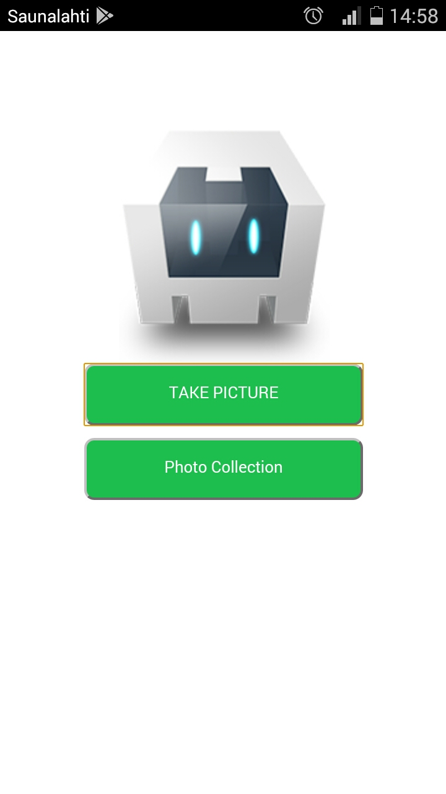
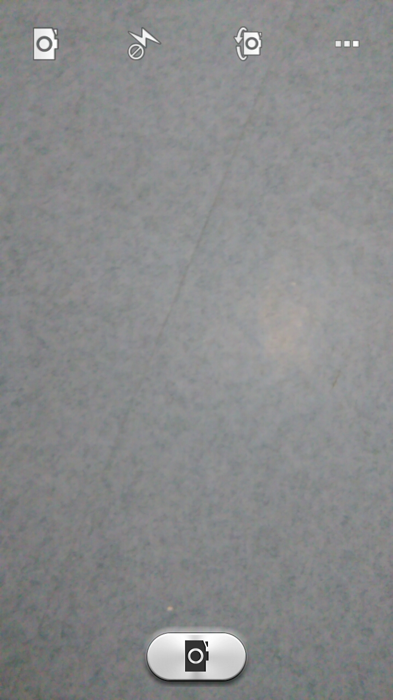
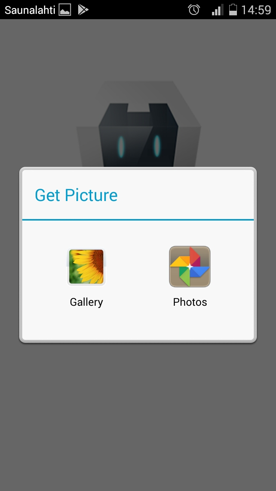
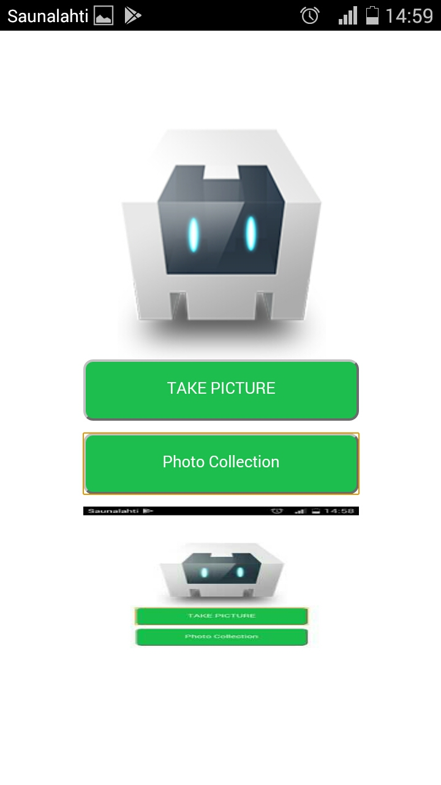

# cordovaCamera_ex1
About the  camera plugin in cordova

step 1:npm install -g cordova 
step2:cordova create CordovaCameraApp com.example.CordovaCameraApp CordovaCameraApp 
step3:cd CordovaCameraApp 
step4:cordova platform add android 
step5:cordova build 
step6:cordova emulate android or try with "\CordovaCameraApp\platforms\android\app\build\outputs\apk\debug\app-debug.apk" 

If application is running properly then we can install camera plugin with step7 

step7:cordova plugin add cordova-plugin-camera 

<h3>Screenshot of Application</h3>
</img>
</img>
</img>
</img>
